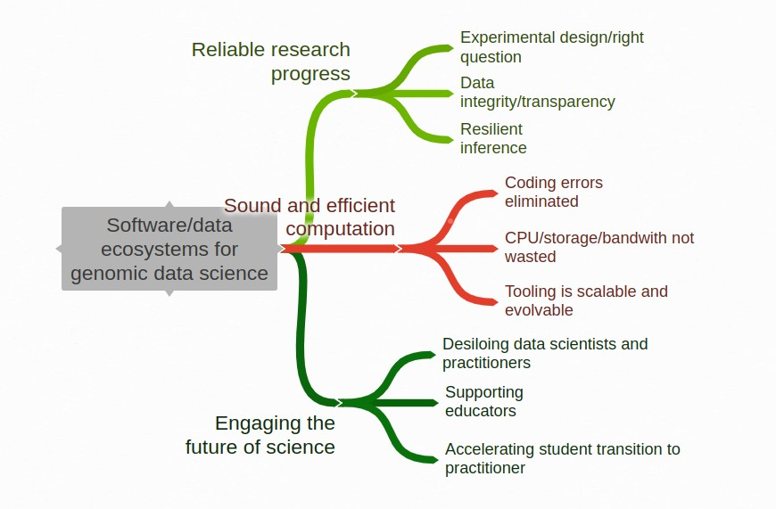

# Overview

Hundreds of software tools and data repositories have
been created in response to the development of sequence-based
methods for interrogating molecular processes and structures
within single cells.  This package, SCecosys, explores
some of these resources from the perspective of
ecosystem principles.  A major question is: How can
we establish dynamic coherence among diverse approaches
to representing and analyzing large complex data
arising from single cell experiments?

Some of the main topics of interest are laid out
in this map:

An important question to consider: As a participant in an
ecosystem, you have opportunities to *consume* and *produce*.
What are your roles as *producer* and how do you balance the
values you get as *consumer*?

Use the "Articles" tab above for more details.
